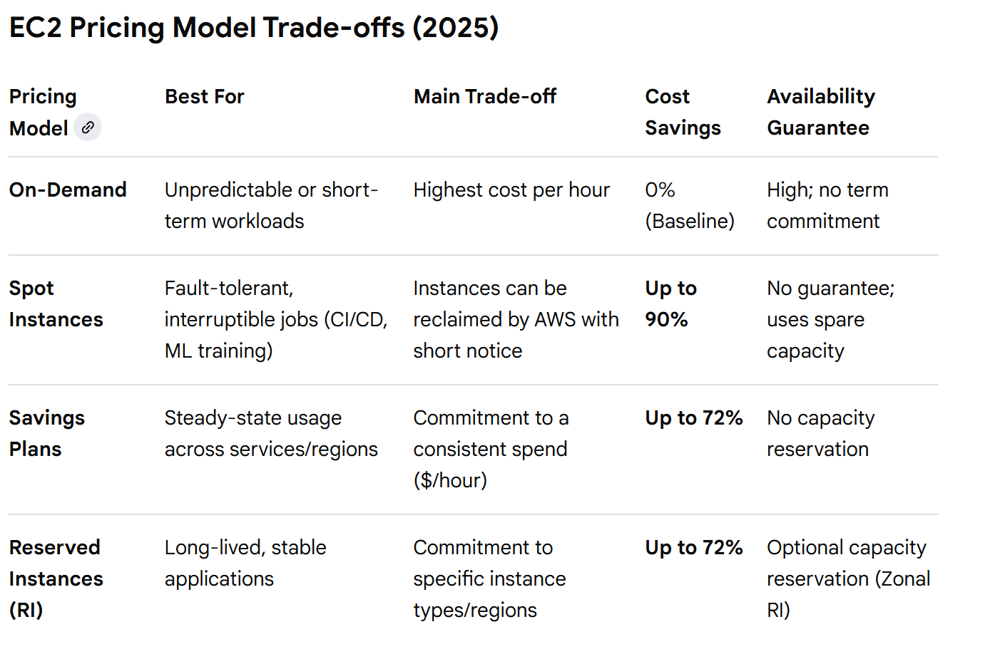
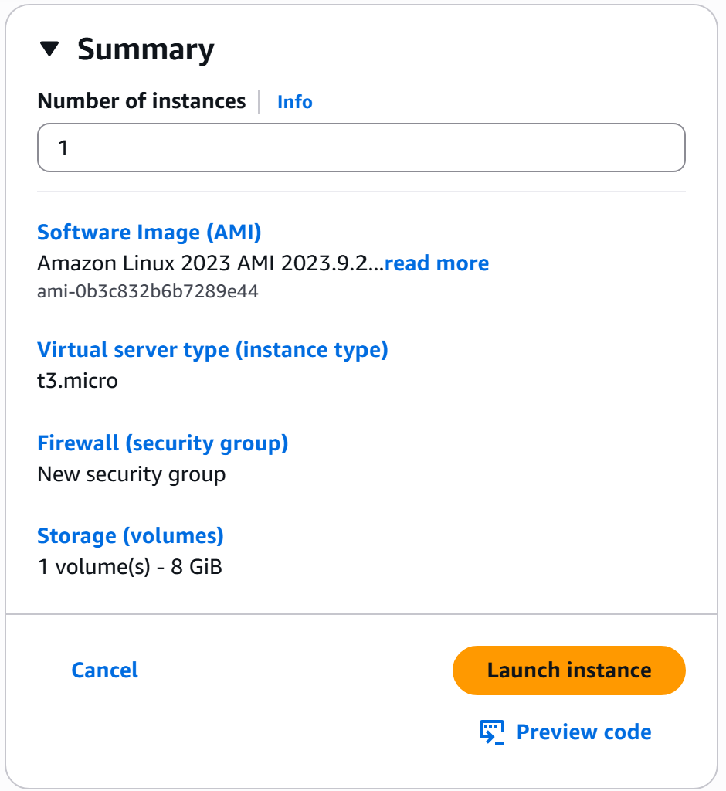
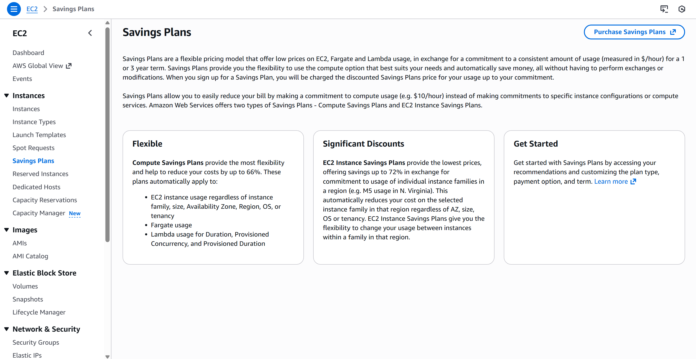
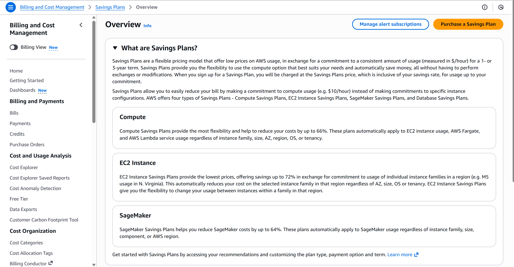
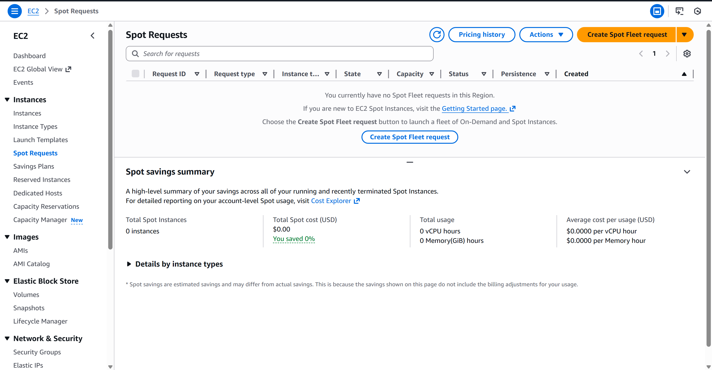

 # EC2 Pricing Evolution
## How AWS Pricing Models Reflect Real-World Workloads

---

## Table of Contents
1. [Objectives](#1-objectives)
2. [Three Key Pillars](#2-three-key-pillars)
3. [Evolution](#3-evolution)
4. [Trade-Offs & Guarantees](#4-trade-offs--guarantees)
5. [Scenario & Screenshots](#5-scenario--screenshots)
6. [Conclusion](#6-conclusion)
7. [References](#7-references)

---

## 1. Objectives
- Understand the differences between On-Demand, Savings Plan, Reserved Instances, and Spot Instances.
- Explore trade-offs related to cost, reliability, flexibility, and commitment.
- Demonstrate a real-world approach to designing workloads with EC2 pricing models.

---

## 2. Three Key Pillars
- **Commitment vs. Flexibility:** How your choice affects your long-term and short-term cost.  
- **Reliability Conception:** How design affects the perceived and actual reliability of instances.  
- **Time Horizon on Workloads:** How workload duration impacts which pricing model is optimal.

---

## 3. Evolution
**Why I called AWS Pricing “Evolution” ( not comparison):**  

1. “Which is cheaper?” ❌  
2. “What discount do I get?” ❌  
3. “What am I committing to, for how long, and under what risk?” ✅  

This narrative demonstrates the progression from simple cost-based decisions to reasoned workload-aware planning.

---

## 4. Trade-Offs & Guarantees
| Pricing Model       | Cost      | Reliability | Flexibility | Commitment |
|--------------------|----------|------------|------------|------------|
| On-Demand           | High     | High       | Full       | None       |
| Savings Plan        | Lower    | High       | Medium     | 1-3 years  |
| Reserved Instances  | Lower    | High       | Low        | 1-3 years  |
| Spot Instances      | Lowest   | Variable   | High       | None       |

>   
> Screenshot illustrating EC2 pricing trade-offs and guarantees for each model.

---

## 5. Scenario & Screenshots
**Scenario:** A steady web application running 24/7 for a year.

### On-Demand

Launching EC2 Instance

EC2 on demand Instance summary
 

EC2 on demand Instance details
 

EC2 on demand Instance lifecycle details

Terminated EC2 Intance 
 

[AWS On-Demand Documentation](https://aws.amazon.com/ec2/pricing/on-demand/)

### Savings Plan

Savings Plan Overview
 

Savings Plan Overview on Billing Page
 

Currently hold no saving Plan

[AWS Savings Plan Documentation](https://aws.amazon.com/ec2/savings-plans/)

### Reserved Instances

Reserved Instances Overview
  

[AWS Reserved Instances Documentation](https://aws.amazon.com/ec2/pricing/reserved-instances/)

### Spot Instances

Currently hold no Spot Instances
 

[AWS Spot Instances Documentation](https://aws.amazon.com/ec2/spot/)

> These screenshots visualize the evolution of EC2 pricing decisions, helping viewers quickly understand cost, reliability, and flexibility without reading the full text.

---

## 6. Conclusion

- Pricing decisions evolve from simple cost comparison to a deeper understanding of trade-offs and workload requirements.  
- Real-world workloads benefit from combining multiple pricing models:  
  - On-Demand for temporary needs  
  - Savings Plan for predictable steady workloads  
  - Reserved Instances for guaranteed long-term usage  
  - Spot for background jobs or flexible tasks  
- "In AWS, the trade-off is between upfront commitment and architectural flexibility; the only guarantee of lower cost is your willingness to sacrifice On-Demand agility for long-term savings."

---

## 7. References
- [AWS EC2 Pricing Overview](https://aws.amazon.com/ec2/pricing/)  
- [AWS Savings Plans](https://aws.amazon.com/ec2/savings-plans/)  
- [AWS Reserved Instances](https://aws.amazon.com/ec2/pricing/reserved-instances/)  
- [AWS Spot Instances](https://aws.amazon.com/ec2/spot/)  

---
 
